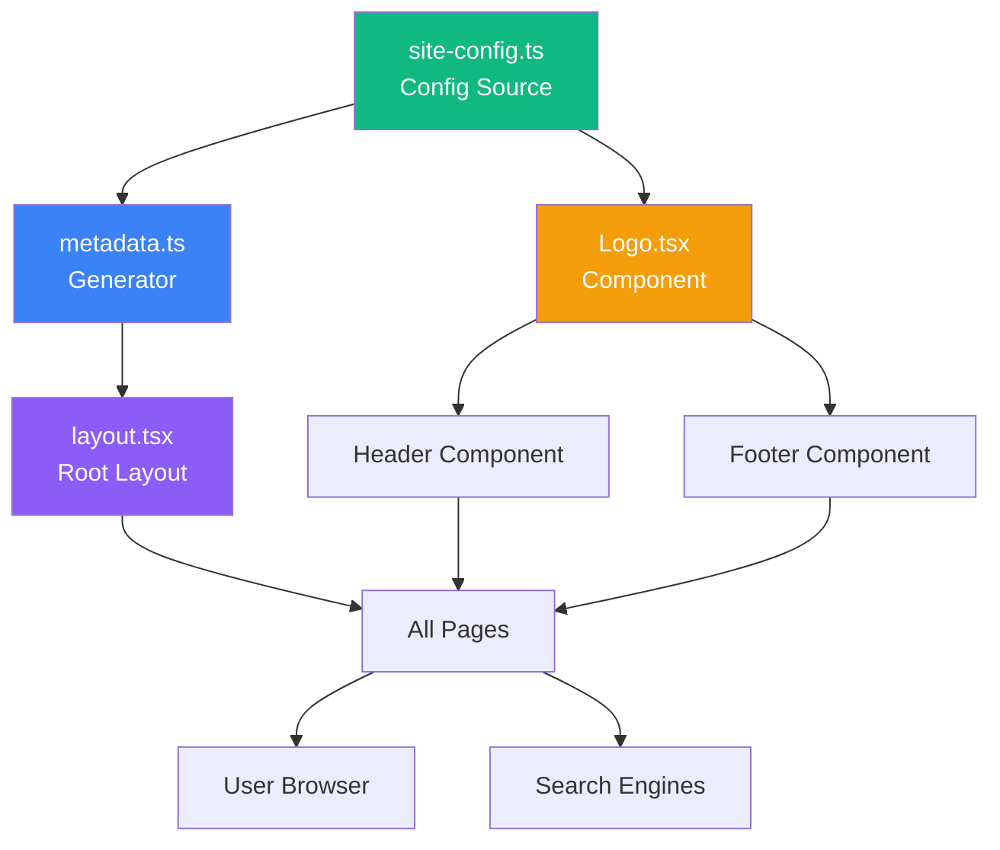

# 🏗️ Kiến Trúc Hệ Thống Site Configuration

## 📊 Sơ Đồ Tổng Quan

```
┌─────────────────────────────────────────────────────────────┐
│                    ROVING VIETNAM WEBSITE                   │
└─────────────────────────────────────────────────────────────┘
                              │
                              ▼
        ┌─────────────────────────────────────────┐
        │     lib/site-config.ts                  │
        │     (Trung tâm cấu hình)               │
        │  • Name, Description, URL               │
        │  • Logo paths, Favicon paths           │
        │  • Contact, Social, Business Info      │
        │  • Theme colors, Keywords              │
        └─────────────────────────────────────────┘
                              │
                ┌─────────────┼─────────────┐
                ▼             ▼             ▼
        ┌───────────┐  ┌───────────┐  ┌───────────┐
        │  Metadata │  │   Logo    │  │  Layout   │
        │ Generator │  │ Component │  │  (Root)   │
        └───────────┘  └───────────┘  └───────────┘
                │             │             │
                └─────────────┼─────────────┘
                              ▼
                    ┌──────────────────┐
                    │   Every Page     │
                    │  • SEO Meta      │
                    │  • Logo Display  │
                    │  • Schema.org    │
                    └──────────────────┘
```

## 🔄 Data Flow

```
1. USER sửa site-config.ts
        ↓
2. Build Time: generateMetadata() đọc config
        ↓
3. Generate metadata cho từng page
        ↓
4. Inject vào HTML <head>
        ↓
5. Google/Facebook crawl metadata
        ↓
6. SEO ranking improved ✨
```

## 📂 File Structure

```
Rovingvn-app/
├── lib/
│   ├── site-config.ts          ⭐ SOURCE OF TRUTH
│   └── metadata.ts              🔧 Metadata Generator
│
├── components/
│   ├── Logo.tsx                 🎨 Logo Component
│   └── examples/
│       └── HeaderFooterExample.tsx
│
├── app/
│   ├── layout.tsx               📄 Root Layout (Updated)
│   └── sitemap.ts               🗺️  Dynamic Sitemap
│
├── public/
│   ├── images/
│   │   ├── logo.png             🖼️  Main Logo
│   │   ├── logo-dark.png
│   │   ├── logo-small.png
│   │   └── og-image.jpg         📱 Social Share Image
│   ├── favicon.ico              🔖 Favicon
│   ├── favicon-16x16.png
│   ├── favicon-32x32.png
│   ├── apple-touch-icon.png
│   ├── android-chrome-*.png
│   ├── manifest.json            📱 PWA Manifest
│   └── robots.txt               🤖 SEO Robots
│
└── 📚 Documentation/
    ├── SITE_INFO_SUMMARY.md     📖 Tổng quan
    ├── QUICK_REFERENCE.md       ⚡ Quick Start
    ├── SITE_CONFIG_GUIDE.md     📘 Chi tiết
    └── create-placeholder-images.sh
```

## 💡 Component Relationships



## 🎯 Usage Patterns

### Pattern 1: Basic Page Metadata
```typescript
// app/tours/page.tsx
import { generateMetadata } from "@/lib/metadata";

export const metadata = generateMetadata({
  title: "Tours",
  description: "Explore our tours",
});
```

### Pattern 2: Logo in Header
```tsx
// components/Header.tsx
import { Logo } from "@/components/Logo";

export function Header() {
  return <Logo variant="main" height={48} priority />;
}
```

### Pattern 3: Access Config Values
```tsx
// Any component
import { siteConfig } from "@/lib/site-config";

export function ContactInfo() {
  return (
    <a href={`tel:${siteConfig.contact.phone}`}>
      {siteConfig.contact.phone}
    </a>
  );
}
```

## 🔍 SEO Optimization Flow

```
┌──────────────────────────────────────────────────────┐
│  1. site-config.ts                                   │
│     └─ Define: name, description, keywords           │
└───────────────────────────┬──────────────────────────┘
                            ▼
┌──────────────────────────────────────────────────────┐
│  2. metadata.ts                                      │
│     └─ Generate: Open Graph, Twitter Cards          │
│     └─ Generate: JSON-LD Structured Data            │
└───────────────────────────┬──────────────────────────┘
                            ▼
┌──────────────────────────────────────────────────────┐
│  3. layout.tsx                                       │
│     └─ Inject metadata into <head>                  │
│     └─ Add JSON-LD scripts                          │
└───────────────────────────┬──────────────────────────┘
                            ▼
┌──────────────────────────────────────────────────────┐
│  4. sitemap.ts                                       │
│     └─ Auto-generate /sitemap.xml                   │
└───────────────────────────┬──────────────────────────┘
                            ▼
┌──────────────────────────────────────────────────────┐
│  5. Search Engines                                   │
│     └─ Google, Bing crawl and index                 │
│     └─ Rich results in search                        │
└──────────────────────────────────────────────────────┘
```

## 🎨 Logo Variants System

```
                    ┌──────────────────┐
                    │   Logo Source    │
                    │ (Your Design)    │
                    └────────┬─────────┘
                             │
            ┌────────────────┼────────────────┐
            ▼                ▼                ▼
    ┌─────────────┐  ┌─────────────┐  ┌─────────────┐
    │   Main      │  │    Dark     │  │   Small     │
    │ 300x100px   │  │  300x100px  │  │ 100x100px   │
    │ Light BG    │  │  Dark BG    │  │   Mobile    │
    └─────────────┘  └─────────────┘  └─────────────┘
            │                │                │
            ▼                ▼                ▼
        Header          Footer          Mobile Nav
```

## 🛠️ Build Process

```
┌──────────────┐
│ npm run dev  │  Development
└──────┬───────┘
       │
       ▼
┌──────────────────────────────────┐
│ Hot Reload                       │
│ • site-config.ts change detected │
│ • Auto rebuild metadata          │
│ • Refresh browser                │
└──────────────────────────────────┘

┌──────────────┐
│ npm run build│  Production
└──────┬───────┘
       │
       ▼
┌──────────────────────────────────┐
│ 1. TypeScript compilation        │
│ 2. Generate static metadata      │
│ 3. Optimize images               │
│ 4. Generate sitemap.xml          │
│ 5. Bundle JavaScript             │
└──────┬───────────────────────────┘
       │
       ▼
┌──────────────────────────────────┐
│ Deploy to Vercel                 │
│ • SEO-optimized                  │
│ • Fast loading                   │
│ • PWA-ready                      │
└──────────────────────────────────┘
```

## 📍 Where Things Are Used

| File/Component | Uses site-config.ts? | Uses metadata.ts? | Uses Logo.tsx? |
|----------------|---------------------|-------------------|----------------|
| app/layout.tsx | ✅ | ✅ | ❌ |
| components/Header | ✅ (optional) | ❌ | ✅ |
| components/Footer | ✅ (optional) | ❌ | ✅ (optional) |
| app/tours/page.tsx | ❌ | ✅ | ❌ |
| app/blog/page.tsx | ❌ | ✅ | ❌ |

## 🔐 Environment Variables Flow

```
.env.local
    │
    ├─ NEXT_PUBLIC_SITE_URL ────────┐
    ├─ NEXT_PUBLIC_GA_ID ───────────┤
    ├─ NEXT_PUBLIC_FB_PIXEL_ID ─────┼──► site-config.ts
    └─ NEXT_PUBLIC_GTM_ID ──────────┘         │
                                              │
                                              ▼
                                     Read at build time
                                              │
                                              ▼
                                     Inject into metadata
```

## 🎯 Key Benefits

```
┌─────────────────────────────────────┐
│  Single Source of Truth             │
│  └─ Change once, update everywhere  │
└─────────────────────────────────────┘
                │
┌───────────────┼────────────────┐
▼               ▼                ▼
Type Safe    Maintainable    SEO Ready
```

---

## 🚀 Quick Commands

```bash
# Development
npm run dev          # Start dev server

# Production
npm run build        # Build for production
npm start            # Run production build

# Utilities
./create-placeholder-images.sh  # Generate placeholder images
```

---

**📌 Remember**: Tất cả thay đổi chỉ cần sửa 1 file: **`lib/site-config.ts`**
